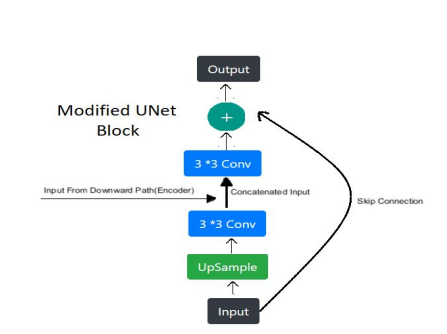
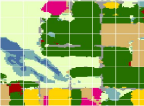
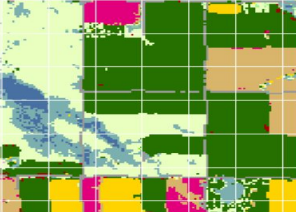

# AgricultureNet

AGricultureNet is A Highly Customised Segmentation Model that takes in Input data From The LandSat8(MultiSpectral Data(7 Channels)) And Outputs a Segmentation Mask of 256 Crop Categories

## Modifications Made In The Standard Model
Used AN Upward Path With Skip Connections Along With Spatial Excitation 

## Results

The Model Achieved Training Accuracy Over 85% and Validation Accuracy Over 80%.Here Are the Results and the Ground Truth of the Validatio Set 
### Generated Mask

### Original Ground Truth

